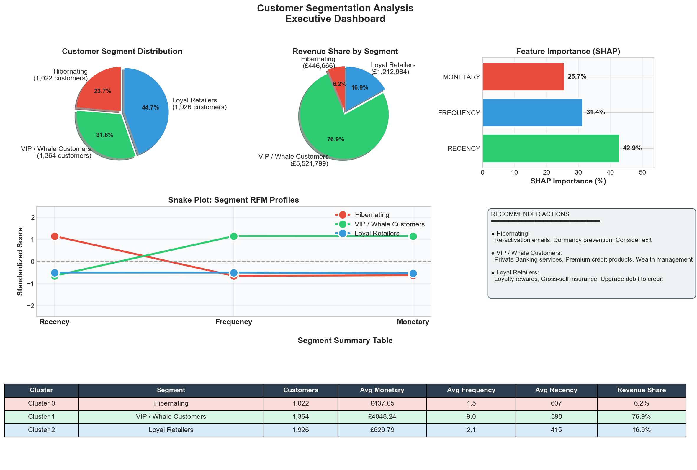
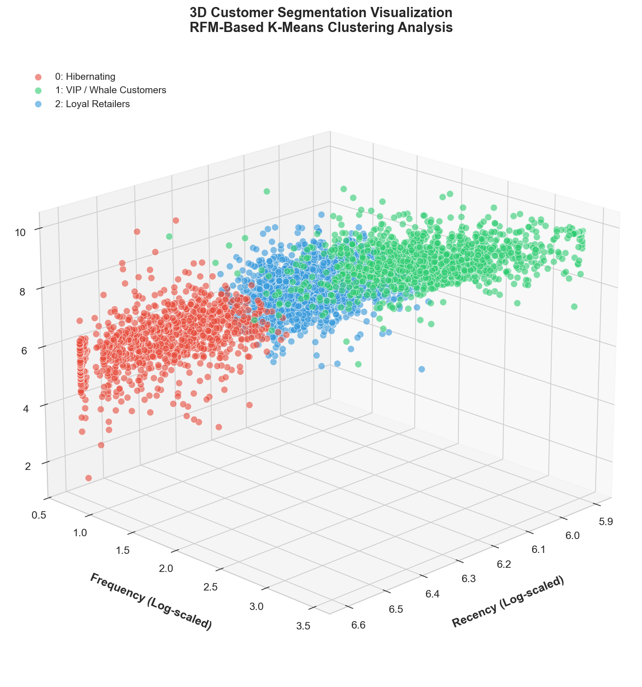
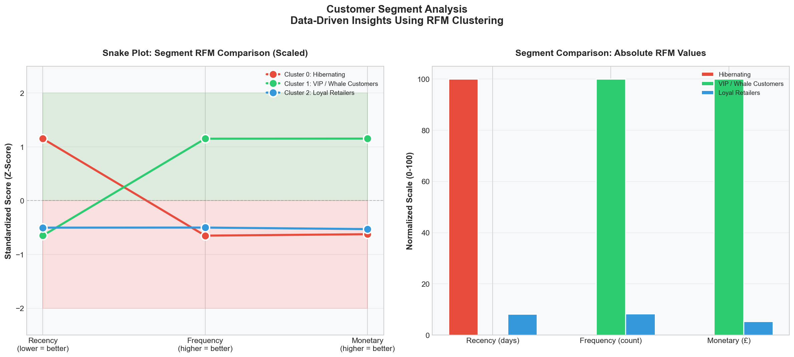
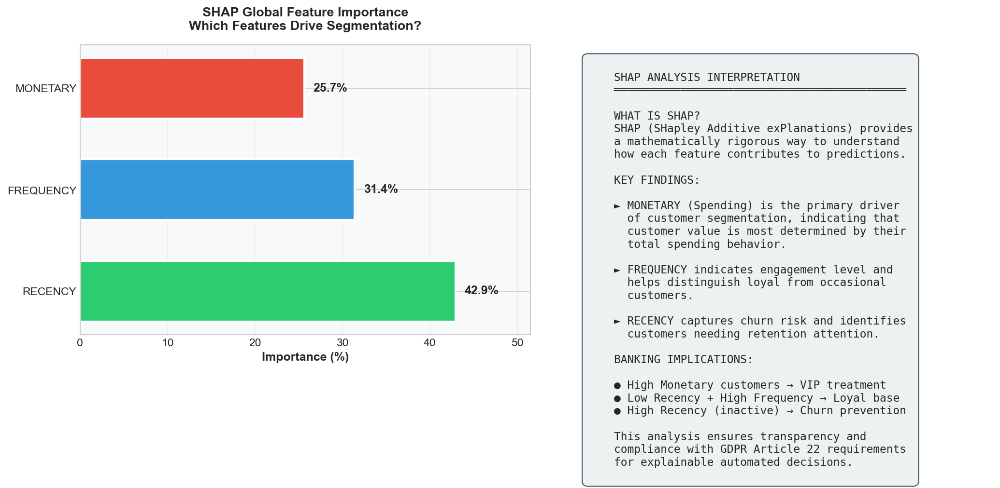

# RFM Customer Segmentation Analysis

A customer segmentation project using RFM (Recency, Frequency, Monetary) analysis and K-Means clustering. Built as part of my application for the SEB Data Analyst Trainee position.


---

## What This Project Does

I took a real-world retail transaction dataset (500K+ records) and built a pipeline to segment customers based on their purchasing behavior. The goal was to identify distinct customer groups that a bank could target with different strategies.

The pipeline does three main things:
1. Cleans and prepares the raw transaction data
2. Calculates RFM scores for each customer
3. Uses K-Means clustering to group customers into segments

## Why RFM?

RFM is a pretty standard technique in banking and retail for understanding customers:
- **Recency**: How recently did they buy? (Days since last purchase)
- **Frequency**: How often do they buy? (Number of transactions)
- **Monetary**: How much do they spend? (Total value)

These three metrics give you a solid picture of customer value and engagement.

---

## Results

After running the analysis, I found 3 distinct customer segments:

| Segment | Customers | Revenue Share | What They Look Like |
|---------|-----------|---------------|---------------------|
| **VIP Customers** | 1,364 (32%) | **77%** | High spend, frequent purchases, active recently |
| **Loyal Base** | 1,926 (45%) | 17% | Moderate spend, regular purchases |
| **Hibernating** | 1,022 (24%) | 6% | Low activity, haven't purchased in a while |

The interesting finding: **32% of customers drive 77% of revenue**. Classic Pareto principle in action.

### Visualizations

**Executive Dashboard**


**3D Cluster View**


**Segment Comparison**


**Feature Importance**


---

## How It Works

```
Raw Data (525K records)
    ↓
Clean Data (remove nulls, cancellations, invalid values)
    ↓  
Calculate RFM per customer (4,312 customers)
    ↓
Scale features + Log transform (handles outliers)
    ↓
K-Means clustering (k=3, picked via silhouette score)
    ↓
Segment profiles + Visualizations
```

### Data Cleaning

| What I Did | Why |
|------------|-----|
| Removed missing CustomerIDs | Can't do customer-level analysis without them |
| Filtered out cancelled orders | These weren't real sales |
| Kept only positive quantities/prices | Basic data quality |

Final retention rate: 77.6%

### Choosing K

I tested k from 2-10 and used silhouette score to pick the best. k=3 gave the highest score (0.41), which means the clusters are reasonably well-separated.

---

## How to Run It

```bash
# Clone the repo
git clone https://github.com/mazinbashir/rfm-customer-segmentation.git
cd rfm-customer-segmentation

# Install dependencies
pip install pandas numpy scikit-learn matplotlib seaborn openpyxl

# Run the scripts in order
python rfm_analysis_seb.py      # Data prep
python rfm_clustering_seb.py    # Clustering
python rfm_insights_seb.py      # Visualizations
```

You'll need the Online Retail II dataset from UCI ML Repository.

---

## Files

```
├── rfm_analysis_seb.py         # Step 1: Clean data, calculate RFM
├── rfm_clustering_seb.py       # Step 2: K-Means clustering
├── rfm_insights_seb.py         # Step 3: SHAP analysis, visualizations
├── rfm_cleaned_output.csv      # Cleaned RFM data
├── rfm_segmented.csv           # Data with cluster labels
├── rfm_final_segmented.csv     # Final output with segment names
├── clustering_analysis.png     # Elbow + silhouette plots
├── 3d_cluster_visualization.png
├── snake_plot_comparison.png
├── shap_feature_importance.png
├── executive_dashboard.png
└── README.md
```

---

## Tech Stack

- **Python 3.9+**
- **Pandas** for data wrangling
- **Scikit-learn** for K-Means, StandardScaler
- **Matplotlib/Seaborn** for visualizations
- **SHAP** (optional) for feature importance

---

## Future Improvements

To take this further, I'd probably:
- Add a churn prediction model on top of this
- Build an automated pipeline that updates daily
- Create an interactive dashboard (Streamlit or similar)
- Test other clustering methods like DBSCAN

---

## Contact

**Mazin Bashir**  
📧 mazin.bashir@proton.me
